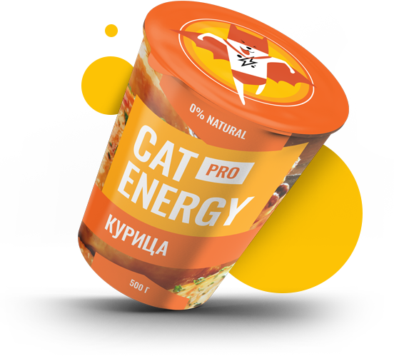

# Cat-Energy

Учебный проект Cat-Energy выполнен в рамках курса Фронтенд разработчик от [htmlacademy](https://htmlacademy.ru)


# Результат работы

### Результат доступен по ссылке [https://lebedev05tmn.github.io/cat-energy](https://lebedev05tmn.github.io/cat-energy)

##### Вид главной страницы при загрузке


## В рамках проекта освоены такие знания как:

- ### Разметка по метододологии БЭМ нотации

##### Пример разметки блока навигации

```html
<section class="page-main__promo promo">
  <div class="promo__container">
    <h2 class="title border-none--1">Функциональное питание для котов</h2>
    <p class="promo__text">Занялся собой? Займись котом!</p>
    <picture
      ><source
        class="promo__image"
        media="(min-width: 1240px)"
        srcset="img/can-desktop.png" />
      <source
        class="promo__image"
        media="(min-width: 708px)"
        srcset="img/can-tablet.png" />
      </picture
    ><a class="button" href="form.html">подобрать программу</a>
  </div>
</section>
```

- ### Стилизация и автоматизация с помощью препроцессора SCSS(SASS)

##### Пример

```scss
@mixin font($family, $weight, $size, $lh, $color) {
  @if ($family==0) {
    font-family: "Oswald";
  } @else {
    font-family: "Arial", sans-serif;
  }
  @if ($weight==0) {
    font-weight: 400;
  } @else {
    font-weight: $weight;
  }
  font-size: $size;
  line-height: $lh;
  @if ($color==0) {
    color: $baseBlack;
  } @else {
    color: $color;
  }
}
```

- ### Создание и использование адаптивных флекс и грид сеток на странице

##### Пример создания адаптивных сеток

```scss
.additional {
    width: 100%;
    &__container {
        display: flex;
        flex-direction: column;
        width: $mobilePercent;
        margin: 0 auto;
        padding-bottom: 35px;
        @media (min-width: $tabletWidth) {
            width: 92%;
            padding-bottom: 76px;
        }
        @media (min-width: $desktopWidth) {
            width: $desktopPercent;
            flex-direction: row;
            justify-content: space-between;
            padding-bottom: 86px;
        }
    }
    ...
}
```

- ### Реализация адаптивной(резиновой) графики в вёрстке

##### Пример реализации адаптивной графики

```scss
.about {
    width: $mobilePercent;
    margin: 0 auto;
    @media (min-width: $tabletWidth) {
        width: $tabletPercent;
    }
    @media (min-width: $desktopWidth) {
        width: 46.56%;
    }
    ...
}
```

- ### Оптимизация вёрстки

##### Пример оптимизации

[gulpfile.js](https://github.com/lebedev05tmn/cat-energy/blob/main/gulpfile.js)

```js
import imagemin from "gulp-imagemin";

export const optimizeImages = () => {
  return gulp.src("source/img/*").pipe(imagemin()).pipe(gulp.dest("build/img"));
};
```

- ### Автоматизация и сборка проекта

##### Пример сборки

[gulpfile.js](https://github.com/lebedev05tmn/cat-energy/blob/main/gulpfile.js)

```js
export const build = cb => {
  cb();
};

build(gulp.series(styles, htmlminify, script, optimizeImages, sprite, copy));
```

## Цель создания и описание работы:

1. Цель создания:
   - получение практических навыков
   - создание учебного проекта
2. Описание работы:
   - верстка макета по БЭМ-нотации
   - адаптивная/резиновая стилизация элементов и сеток страницы
